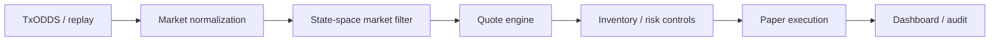

# World Cup Consensus Maker

**A latency-aware autonomous World Cup paper market maker that uses TxODDS market consensus, dynamically manages spread and inventory risk, and suspends quoting during stale data or information shocks.**

This project is a paper-execution demonstration for the Trading Tools and Agents track. It turns replayed or available TxODDS observations into normalized market state, filtered consensus, two-sided quotes, deterministic risk decisions, paper fills, P&L, and an inspectable audit trail.

## Problem

Sports markets can move faster than a human operator can consistently reprice, resize, and risk-check every quote. A useful market-making system must distinguish source data from its own derived state, manage inventory without taking uncontrolled directional risk, stop when information is stale or discontinuous, and explain every action after the fact.

## Product

The dashboard demonstrates the complete paper market-making loop:

- TxODDS-recorded or deterministic replay provenance
- market and selection normalization
- state-space filtering of market consensus
- adaptive bid, ask, width, and size
- inventory-aware quote lean
- information-shock suspension and controlled resumption
- future-event paper fills without weakening fill assumptions
- positions, realized and unrealized P&L, and worst-case liability
- reason-coded risk checks and audit evidence

Prominent dashboard labels make the boundary explicit: **paper market making**, **not proprietary alpha**, **directional trading disabled**, and **real execution disabled**.

## Architecture



The TypeScript monorepo separates shared contracts, market data, filtering, quoting, portfolio, risk, paper execution, evaluation, the API, and the React dashboard. Zod validates the demo-state boundary consumed by the browser.

## TxODDS integration

TxODDS is treated as a source of market consensus, not as proprietary model output.

- Replay mode runs without credentials and supports the deterministic built-in sequence.
- A recorded TxODDS capture can be selected when the backend is started with a valid `REPLAY_FILE`.
- The dashboard reads the existing `/health` status for the TxODDS adapter.
- If a live field or endpoint is not exposed, the dashboard says **Unavailable from API**; it does not manufacture fixture, timestamp, recording, or connection data.
- Source timestamps and receive timestamps remain distinct wherever the backend contract supplies them.

The repository includes capture utilities for authorized, read-only TxODDS access. Credentials remain server-side and must never be committed or sent to the frontend.

## Market-making logic

For each normalized selection, the demo:

1. observes market consensus;
2. applies the state-space market filter and uncertainty estimate;
3. derives a quote centre;
4. expands width with uncertainty, volatility, and inventory pressure;
5. leans the quote against accumulated inventory;
6. reduces size as inventory grows;
7. suspends quotes during configured information shocks; and
8. resumes only after the replay emits a controlled repricing event.

The UI calls the derived value **filtered market consensus**. It is demo machinery, not proprietary alpha and not evidence of historical profitability.

## Risk and latency controls

- data-freshness and stale-data boundaries
- information-shock quote suspension
- position, order-size, market, fixture, and portfolio limits
- worst-case terminal outcome scenarios
- drawdown and risk-budget utilization
- kill-switch state
- paper-only execution and reason-coded audit events
- explicit separation of market-making inventory from directional trading

## Demo instructions

1. Start the API and dashboard using the local setup below.
2. Confirm **Backend: CONNECTED** and **Deterministic Replay** or **Recorded TxODDS Replay**.
3. Keep **Run Full Demo** as the primary action and click it once.
4. Use **Pause**, **Resume**, **Step**, **Reset**, and the **1x / 5x / 20x / 60x** speed selector as needed.
5. Point out normal two-sided quoting, widening during volatility, inventory lean, suspension, controlled resumption, a future-event paper fill, and the resulting risk/P&L update.
6. Use **Inject information shock** to demonstrate immediate quote protection.
7. Finish on the audit reason codes and paper-execution disclaimer.

The full three-minute script is in [`docs/demo-narration.md`](docs/demo-narration.md), with camera guidance in [`docs/video-shot-list.md`](docs/video-shot-list.md).

## Local setup

Requirements: Node.js 20+ and npm.

```powershell
Set-Location "E:\Hackathons\World-Cup-live-mvp"
npm.cmd install
Copy-Item ".env.example" ".env" -ErrorAction SilentlyContinue
npm.cmd run dev
```

Open:

- Dashboard: <http://localhost:5173>
- API readiness: <http://localhost:8787/ready>
- API health: <http://localhost:8787/health>

Optional frontend configuration:

```text
VITE_API_BASE_URL=http://localhost:8787
```

Verification:

```powershell
npm.cmd run typecheck
npm.cmd test
npm.cmd run build
npx.cmd playwright test
```

## Deployment links

- Public dashboard: **[ADD PUBLIC WEB URL]**
- Public API health: **[ADD PUBLIC API `/health` URL]**
- Public API readiness: **[ADD PUBLIC API `/ready` URL]**
- Demo video: **[ADD DEMO VIDEO URL]**
- Submission page: **[ADD HACKATHON SUBMISSION URL]**

See [`docs/deployment.md`](docs/deployment.md) for the existing Railway/Vercel environment boundary.

## Security

- No real order-routing or wallet operation is enabled.
- The browser receives no TxODDS token, JWT, wallet key, or seed phrase.
- Secrets belong in local or deployment environment variables and are excluded from source control.
- API write actions are rate-limited and CORS-restricted by the configured frontend origin.
- Captures and logs must be reviewed before publication to ensure they contain no credentials.

## Limitations

- This is a hackathon MVP and paper-execution demonstration, not a production trading system.
- Replay results are deterministic and are not a backtest or claim of profitability.
- The built-in fixture is synthetic; recorded TxODDS replay is available only when a valid capture is configured.
- Live fixture discovery, recording telemetry, source timestamps, and cash are shown only when existing backend contracts expose them.
- The state-space filter is a transparent demo benchmark, not proprietary alpha.
- Execution assumptions remain conservative; fills occur only on explicit future replay events.
- Combination-market pricing and correlated risk aggregation remain out of scope.
- Deployment URLs must be added after public services are provisioned.

## Paper-execution disclaimer

**All quotes, orders, fills, positions, cash figures, and P&L shown by this project are simulated. Real execution is disabled. Nothing in this repository is investment advice, a live-trading claim, or evidence of future performance.**
