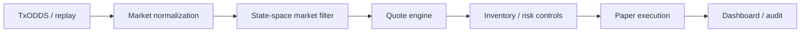

# Architecture for Judges

## What the system demonstrates

World Cup Consensus Maker is a paper-execution control loop for two-sided World Cup markets. Its contribution is the orchestration of provenance, filtering, adaptive quoting, inventory control, risk suspension, future-event execution assumptions, and reason-coded auditability in one deterministic demo.

It does not claim a proprietary prediction edge. TxODDS is presented as market consensus, and the state-space filter is presented as a transparent demo benchmark.

## End-to-end flow

1. **TxODDS or replay:** the runtime selects live mode, an authorized recorded capture, or the deterministic built-in replay.
2. **Market normalization:** source fixture, market, selection, probability, timestamps, and provenance become shared TypeScript/Zod contracts.
3. **State-space market filter:** market consensus is smoothed and paired with an uncertainty estimate. This is the value labelled **Filtered market consensus** in the UI.
4. **Quote engine:** quote centre, width, bid, ask, inventory lean, and bid/ask size are derived from filtered consensus, uncertainty, volatility, and current inventory.
5. **Inventory and risk controls:** stale data, information shocks, limits, drawdown, worst-case outcomes, suspension, and kill-switch state gate quoting.
6. **Paper execution:** fills occur only for explicit future replay events. Real order routing and wallets are disabled.
7. **Dashboard and audit:** validated API state drives the operator view, while each event records observations, width components, risk checks, final action, fill result, provenance, and reason codes.

## Component boundaries

- `packages/contracts`: Zod schemas and TypeScript types for market data, quotes, portfolios, risk, execution, and demo state.
- `packages/market-data`: TxODDS adapter status and the market-data boundary.
- `packages/theo`: the state-space benchmark provider used by the deterministic demo. In the UI this is described as a market filter, not proprietary alpha.
- `packages/quoting`: two-sided quote generation, width, lean, size, and disable states.
- `packages/portfolio`: cash ledger, positions, marks, fees, and realized/unrealized P&L.
- `packages/risk`: deterministic limits, probability shocks, and terminal outcome scenarios.
- `packages/execution`: paper-order lifecycle and fill accounting.
- `packages/evaluation`: maker/taker attribution and performance snapshots.
- `packages/demo`: deterministic replay state machine, events, paper fills, audit, and dashboard state.
- `apps/api`: existing HTTP contracts and replay controls.
- `apps/web`: React operator dashboard and truthful live/replay status presentation.

## Quote behavior

The demo quote loop uses filtered consensus as the starting centre. Width increases with baseline cost, filter uncertainty, and inventory pressure. Inventory lean shifts the centre against the held position, reducing the incentive to accumulate more of the same exposure. Quote size falls as absolute inventory increases. A suspended selection exposes no bid, ask, width, or size.

The dashboard makes these effects inspectable rather than hiding them behind a single recommendation:

- market consensus versus filtered market consensus
- bid and ask
- width
- inventory lean
- bid/ask size
- quote status and reason codes

## Latency and information-shock controls

Market making fails dangerously when a quote remains live after its input becomes stale or discontinuous. The design therefore treats freshness and shocks as execution gates:

- receive/source timing is displayed only when supplied by the backend;
- unavailable live fields are not inferred;
- information shocks suspend affected quotes;
- the audit records the suspension reason;
- resumption requires an explicit repricing/resumption event;
- the kill switch remains visible at all times.

## Execution realism

The demo does not cross its own quotes or create fills merely because a quote exists. A fill requires an explicit event later in the replay. That future-event convention is simple, deterministic, and auditable, while avoiding a common demo error: weakening execution assumptions to manufacture attractive activity.

All execution is simulated. The system does not route real orders, sign transactions, access wallets, or claim realized market performance.

## Risk and accounting

After a paper fill, the portfolio layer updates:

- position and average entry
- realized and unrealized P&L
- fees and maker/taker attribution
- fixture and market exposure
- drawdown and risk-budget utilization
- best- and worst-case terminal P&L

The operator sees worst-case liability as the non-negative loss implied by worst-case terminal P&L. Scenario values and reason codes remain available for audit.

## API and UI truth boundary

The React client preserves the existing demo contracts. It validates `/api/demo/state` and uses existing control endpoints for start, pause, resume, reset, step, speed, source selection, and shock injection. It also reads the existing `/health` endpoint for TxODDS adapter status.

The current demo state does not expose cash, recording telemetry, or a true source timestamp. The dashboard marks those fields **Unavailable from API** instead of deriving plausible-looking values. Replay mode remains fully functional when live services are absent.

## Security boundary

- TxODDS credentials remain server-side environment variables.
- No JWT, API token, wallet key, or seed phrase is placed in the browser bundle.
- The API restricts CORS and rate-limits demo write actions.
- Real execution, wallet operations, and directional trading are disabled.
- Recorded captures must be reviewed before publication.

## Limitations

- The built-in replay is synthetic and deterministic.
- A recorded TxODDS replay requires an authorized capture configured on the backend.
- The state-space filter is a benchmark demonstration, not proprietary alpha or a profitability claim.
- Unsupported live telemetry remains unavailable.
- Combination-market pricing and correlated risk aggregation remain out of scope.
- This architecture has not been presented as production-ready trading infrastructure.
